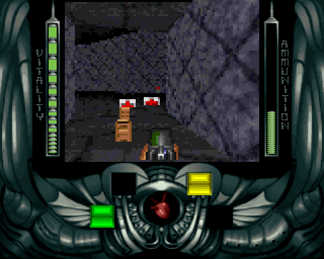
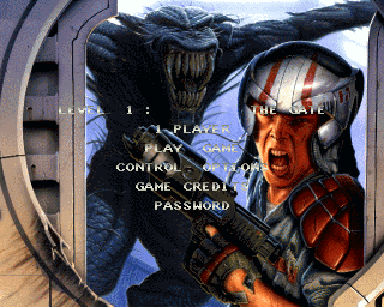
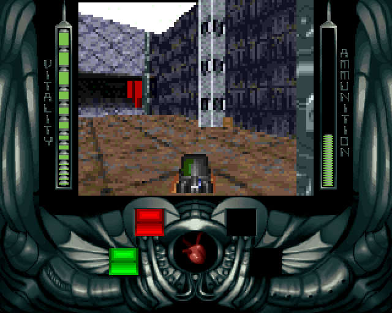
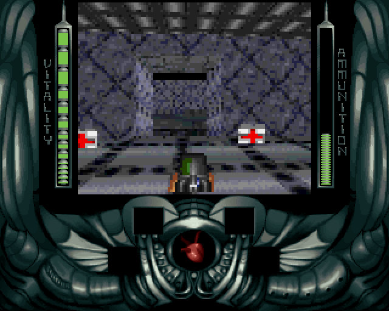

# Alien Breed 3D — portage Java

Portage en Java du moteur d'**Alien Breed 3D** (Team17, 1995), transcrit
ligne à ligne depuis l'assembleur 68000 d'origine.



Le rendu est un rasteriseur logiciel qui reproduit l'arithmétique du 68000 :
mêmes divisions entières, mêmes débordements, même ordre de dessin.
jMonkeyEngine n'ouvre que la fenêtre, lit le clavier et affiche une texture ;
il ne dessine rien lui-même. Les données du jeu d'origine sont lues telles
quelles à l'exécution — aucune conversion hors ligne.

| | |
|---|---|
|  |  |

## Ce qui tourne

Écran-titre en fondu, menu avec mot de passe et reconfiguration des touches,
rendu logiciel complet (murs, sols, plafonds, sprites, arme en main, fond de
ciel, eau), bandeau et jauges, portes, ascenseurs, interrupteurs, clés et
conditions, ramassages, cinq types d'ennemis qui rôdent, repèrent, poursuivent,
mordent et tirent, six armes dont trois à projectiles, explosions avec souffle
et éclats, barils, le son, la fin de niveau avec son mot de passe, et le
lecteur de modules ProTracker.

Un niveau se termine quand le joueur entre dans une salle précise — `ENDZONES`
en donne une par niveau, et c'est là toute la condition de victoire. Gagner
ajoute un au niveau maximum et écrit le mot de passe suivant sur la ligne du
menu ; perdre laisse cette ligne intacte, ce qui interdit de gagner un mot de
passe en mourant.

## Faire tourner

Il faut le jeu d'origine, et il en faut **deux morceaux distincts** :

1. **les deux disquettes** (`.adf`), qui portent les niveaux, les sons, les
   graphismes de murs et d'objets ;
2. **l'arbre des sources** publié par Team17, dont le répertoire `includes/`
   contient tout ce que l'exécutable Amiga avait compilé dedans — table des
   sinus, palettes, bordures d'écran, police du menu, les trois modules de
   musique, tables d'ombrage et d'eau, fond de ciel — et dont les fichiers
   assembleur servent encore de source aux tables.

Sur les vingt-deux fichiers lus à l'exécution, **quatre seulement sont sur les
disquettes**. Les avoir ne suffit donc pas.

**Rien de tout cela n'est dans ce dépôt**, qui ne contient que du code Java.

Depuis un checkout :

```
gradle run -Dab3d.root=../ab3d-rtg -Dab3d.disk=../adf-extract
```

### Application autonome

```
gradle jpackage
```

produit dans `build/dist/` une application avec sa propre JVM, qui n'exige rien
d'installé. Elle ne contient aucune donnée du jeu : au premier lancement elle
demande où sont les disquettes et l'arbre des sources, extrait les deux images
elle-même (le lecteur ADF gère OFS et FFS) et retient la réponse dans
`~/.ab3d-java`. Les lancements suivants démarrent directement.

Pour les disquettes, le premier lancement propose deux routes : indiquer tes
propres fichiers `.adf`, ou les prendre sur **Dream17**, l'archive de
préservation Amiga, qui les sert toutes les deux dans un même fichier. Rien
n'est téléchargé sans que le choix soit fait. L'arbre des sources est demandé
dans les deux cas, parce qu'il n'est sur aucune des deux disquettes.

`-Ppackage=msi` (ou `deb`, `dmg`) produit un installeur natif à la place, si les
outils correspondants sont présents.

### Commandes

Ce sont celles de `CONTROLBUFFER`, pas un schéma moderne, et elles sont
reconfigurables depuis **CONTROL OPTIONS**.

| Touche | Action |
|---|---|
| Flèches ← → | tourner |
| Flèches ↑ ↓ | avancer, reculer |
| `.` `/` | pas de côté |
| Maj droite | courir |
| Alt droit | tirer |
| Espace | portes, ascenseurs, interrupteurs |
| `D` | s'accroupir |
| `L` | regarder derrière |
| `1`–`5` | fusil à impulsion, à pompe, plasma, grenades, roquettes |

Pour changer de niveau, **PASSWORD** dans le menu. Les disquettes portent les
**seize** niveaux, et tous se chargent :

| | | | |
|---|---|---|---|
| 1 The Gate `KLLKFFFFFFFFFFFF` | 2 Storage Bay `KOLKFNFFFFFFFFFF` | 3 Sewer Network `OKLKFHFFFFFFFFFF` | 4 The Courtyard `KPLKFPFFFFFFFFFF` |
| 5 System Purge `PLOPNFFFFFFFFFFF` | 6 The Mines `POOPNNFFFFFFFFFF` | 7 The Furnace `KKLKNHFFFFFFFFFF` | 8 Test Arena Gamma `PPOPNPFFFFFFFFFF` |
| 9 Surface Zone `LLLKHFFFFFFFFFFF` | 10 Training Area `LOLKHNFFFFFFFFFF` | 11 Admin Block `PKLKHHFFFFFFFFFF` | 12 The Pit `LPLKHPFFFFFFFFFF` |
| 13 Strata `OLLKPFFFFFFFFFFF` | 14 Reactor Core `OOLKPNFFFFFFFFFF` | 15 Cooling Tower `LKLKPHFFFFFFFFFF` | 16 Command Centre `OPLKPPFFFFFFFFFF` |



## Le build visé

Le main est **`source/jg.s`**, pas `master.s`. La distinction a compté : sur
les 778 routines que les deux fichiers partagent, 183 diffèrent, et une
quarantaine touchaient au portage — décalages de tuiles, tests de bits contre
comparaisons, sol de Gouraud présent dans l'un et absent de l'autre. Tout ce qui
est transcrit vient de l'arbre d'inclusion de `jg.s`.

## Comment le code est écrit

Chaque routine porte le nom de son original et cite les instructions qui
décident quelque chose. `M68k` fournit les primitives — `divs` qui laisse sa
destination inchangée en cas de débordement, `muls`, `swap`, l'extension de
signe — parce que reproduire ces cas-là est souvent la différence entre une
image juste et une image plausible.

Les tables ne sont pas recopiées : elles sont **lues dans l'assembleur à
l'exécution**. Les animations d'armes, la table des collisions, les
enregistrements d'armes, les écrans de menu, les noms des échantillons, les
touches par défaut — tout est parsé depuis `source/`. Deux entrées de la table
des sons sont commentées ; une recopie à la main aurait décalé d'un cran tout
ce qui suit la dixième.

## Les contrôles de conformité

`src/main/java/ab3d/tools/` contient une cinquantaine de programmes qui vérifient
le portage contre la source, sans ouvrir de fenêtre :

```
gradle tool -Ptool=EnemyCheck
gradle tool -Ptool=PasswordCheck
```

Ils cherchent des accords entre deux endroits écrits séparément. Les douze
touches par défaut existent deux fois dans l'original — comme octets dans
`CONTROLBUFFER` et comme libellés imprimés sur l'écran des contrôles — et les
douze concordent. Les huit listes d'animation d'armes font chacune exactement un
de plus que le compte annoncé ailleurs dans la table. Vingt-sept des vingt-huit
échantillons ont la longueur que la table leur donne.

Le même travail a servi à savoir quoi **ne pas** porter : sur les douze types
d'ennemis, six ne sont posés dans aucun niveau ; il n'y a aucun mur transparent
dans les quatre niveaux ; le visage animé du bandeau a ses données commentées et
sa routine jamais appelée.

## Les bizarreries de l'original, gardées et signalées

Le code note ce qu'il trouve plutôt que de le lisser.

- `CALCPASSWORD` teste quatre armes avec quatre `sne d0` de suite, et `sne`
  écrit l'octet entier : chaque test efface le précédent. Un mot de passe donné
  par le jeu ne peut jamais restituer plus que la dernière arme, alors que
  `GETSTATS` en relit quatre.
- `ComputeBlast` écrit `add.w 32,d3` sans `#` : lu à la lettre, c'est le mot à
  l'adresse absolue 32, et l'atténuation du souffle disparaîtrait.
- Le bloc qui calcule la hauteur au franchissement d'une ligne soustrait `a4`,
  qui est le pointeur de la zone de destination depuis le haut de la boucle.
- La musique de fond ne démarre jamais : la boucle n'appelle le lecteur que si
  l'octet 3 de `Prefsfile` vaut `'b'`, et il s'assemble à `'k4nx'`. Les deux
  jingles de fin de niveau ne sont pas conditionnés, et sont donc la seule
  musique que ce build joue.

## Ce qui manque

Le mode deux joueurs, et les six types d'ennemis que les niveaux ne posent
jamais — robot, ver, grosse chose rouge, arbre, œil, conduite de gaz.

Deux écarts assumés subsistent dans le moteur, tous deux commentés à l'endroit
où ils sont : un refus de déplacement qui n'existe pas dans l'original, parce que
le glissement transcrit laisse un résidu que le sien n'a pas ; et la teinte de
l'eau, dont la table n'a jamais été convertie pour cette version du moteur.

## Licence

Le code de ce dépôt est publié tel quel. **Les données du jeu ne s'y trouvent
pas** et restent la propriété de leurs ayants droit — il faut posséder une copie
d'Alien Breed 3D pour faire tourner ce portage.
